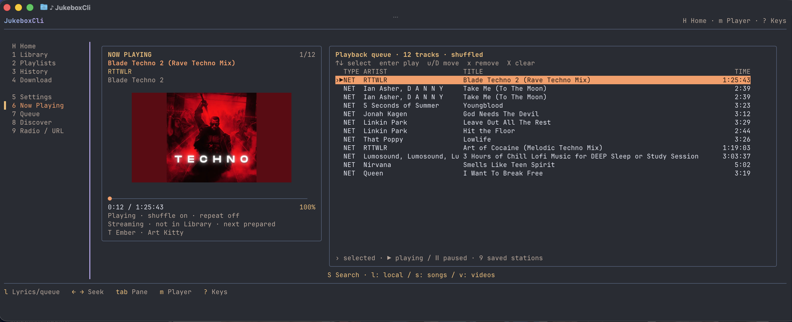

<h1 align="center">Hi, Cześć, Bonjour, Hallo, Hola, Ciao, Привет (Privet), こんにちは (Konnichiwa), 你好 (Nǐ hǎo), مرحبا (Marhaba) 👋</h1>
<p align="center"><em>„Simplicity is a wonderful quality of extraordinary people”</em></p> 

### Glad to see you!


I'm a Full-stack Developer with **~5 years of experience**, mostly working with  **React** and  **Node.js**. To put it simply: I genuinely love programming. Sometimes that means staying up until 6 a.m. because I know the thing I'm building can still be made a little better.

I like solving problems, experimenting with new ideas, and figuring out how things work under the hood. I'm also a bit of a nerd: I started on Windows, moved to Linux, and now I use a Mac with the Dock permanently placed on the left because old habits die hard.

Currently, I'm building Gitastic - a modern Git GUI made with Electron, with AI integrations using LangChain and LangGraph. Maybe I’ll even rewrite it in Rust one day, just because 🦀

Outside of coding, I enjoy traveling, working out, listening to music, and spending time with my little home crew: one dog and two cats.

I believe there’s always a way forward. Problems are meant to be solved, not dwelled on.

I just love what i do, and I'm great at what i do :)
<br>
<br>
<h3 align="center">
  Yeah, I use the terminal for everything, even listening to music... Who needs Spotify? 🎵
</h3>
<br>
<p align="center">
  
</p>
✔️ Fan of:<br>
- OOP<br>
- Strong typing<br>
- Not reinventing the wheel<br>

### **The usual development cycle (before AI 😢)** 🌀

```text
⌨️ Writing code                          ████░░░░░░░░░░░░░░   20%
🐛 Debugging the code                    ██████░░░░░░░░░░░░   30%
🔎 Searching Stack Overflow              ████░░░░░░░░░░░░░░   20%
🩹 Fixing one bug, creating two more     ███░░░░░░░░░░░░░░░   15%
♻️ Refactoring code that already worked  ██░░░░░░░░░░░░░░░░   10%
☕ Wondering why it suddenly works        █░░░░░░░░░░░░░░░░░    5%
```


## 🌐 Socials:
[](https://m.facebook.com/profile.php?id=100008614810091) 
[](https://instagram.com/_jusstuss_)
[](https://www.linkedin.com/in/robert-juszczyński/)

## 💻 Tech Stack:

<div align="center">                                                </div>

<br>

## 📊 GitHub Stats:
<br/>
<br/>


<p align="center">
  
</p>

<h1 align="center">The end</p>
